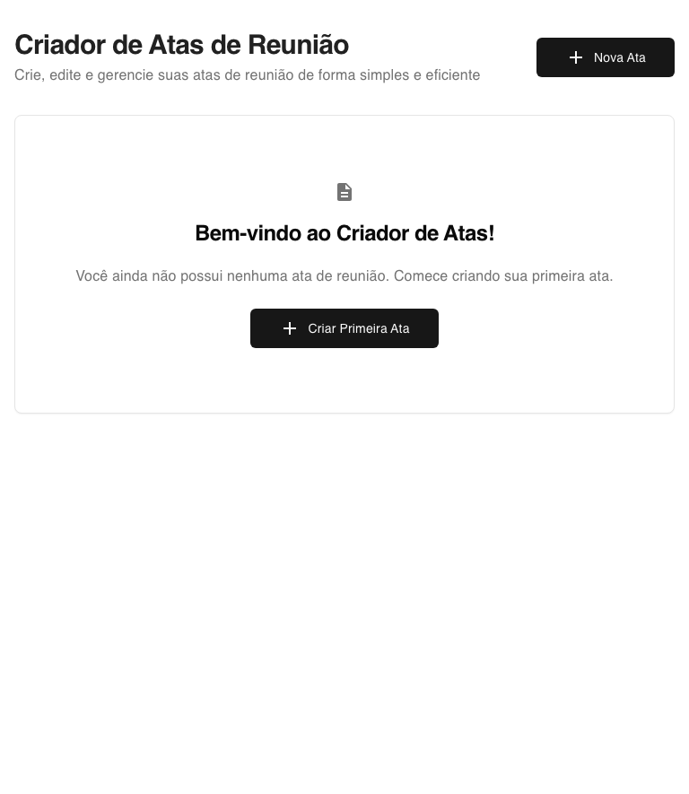

# 📋 Meeting Minutes Creator - Professional Portfolio

> **A complete, production-ready React application for creating, managing, and exporting professional meeting minutes with modern UX/UI design.**

[](https://www.typescriptlang.org/)
[](https://reactjs.org/)
[](https://vitejs.dev/)
[](https://tailwindcss.com/)

---

## 🚀 **Live Demo & Screenshots**

### Desktop Application Interface

*Clean, intuitive landing page with meeting list overview*


*Comprehensive meeting creation form with structured data input*


*Real-time form validation and user-friendly error handling*

### Responsive Design
<div style="display: flex; gap: 20px;">
  
  
</div>

*Fully responsive design optimized for mobile, tablet, and desktop*

---

## 💼 **Technical Highlights**

### **Frontend Architecture**
- **React 19** with latest hooks and concurrent features
- **TypeScript** for type-safe development and better DX
- **Component-driven architecture** with reusable UI components
- **Custom hooks** for state management and business logic separation

### **UI/UX Excellence**
- **shadcn/ui** - Modern, accessible component library
- **TailwindCSS** - Utility-first CSS with consistent design system
- **Responsive design** - Mobile-first approach with breakpoint optimization
- **Form validation** - Real-time validation with user-friendly error messages

### **State Management & Data Flow**
- **React Hook Form** - Performant forms with minimal re-renders
- **Zod** - Runtime type validation and schema parsing
- **Local Storage** - Client-side persistence with automatic sync
- **Custom hooks** - Encapsulated business logic and state management

### **Export & Integration Features**
- **PDF Generation** - Professional document export using jsPDF
- **HTML2Canvas** - High-quality document rendering
- **Date Management** - Advanced date/time handling with date-fns
- **UUID** - Unique identifiers for data integrity

---

## 🎯 **Core Features**

### **Meeting Management**
- ✅ Create comprehensive meeting minutes
- ✅ Edit existing meetings with full data persistence
- ✅ Delete meetings with confirmation dialogs
- ✅ Real-time data validation and error handling

### **Structured Data Input**
- 📝 **Basic Information**: Title, date, time, location
- 👥 **Participants**: Name, email, role with dynamic addition/removal
- 📋 **Agenda Items**: Structured agenda with multiple topics
- 💬 **Discussions**: Detailed discussion topics and notes
- ✅ **Decisions**: Recorded decisions with justifications
- 📌 **Action Items**: Tasks with assignees, due dates, and status tracking

### **Export & Sharing**
- 📄 **PDF Export**: Professional, formatted document generation
- 💾 **Local Storage**: Automatic saving and data persistence
- 📱 **Mobile Optimized**: Full functionality across all devices

---

## 🛠 **Technology Stack**

### **Core Technologies**
```json
{
  \"framework\": \"React 19.1.1\",
  \"language\": \"TypeScript 5.8.3\",
  \"bundler\": \"Vite 7.1.2\",
  \"styling\": \"TailwindCSS 3.4.17\"
}
```

### **Development Tools**
- **ESLint** - Code quality and consistency
- **Prettier** - Code formatting
- **PostCSS** - CSS processing and optimization
- **Autoprefixer** - CSS vendor prefixing

### **Production Dependencies**
```json
{
  \"forms\": \"React Hook Form + Zod\",
  \"ui\": \"shadcn/ui + Radix UI\",
  \"export\": \"jsPDF + html2canvas\",
  \"utils\": \"date-fns + uuid + clsx\"
}
```

---

## 🚀 **Quick Start**

### **Prerequisites**
- Node.js 18+
- npm or yarn
- Modern browser (Chrome, Firefox, Safari, Edge)

### **Installation**
```bash
# Clone the repository
git clone [repository-url]
cd meeting-minutes-document

# Install dependencies
npm install

# Start development server
npm run dev
```

### **Available Scripts**
```bash
npm run dev          # Development server (localhost:5173)
npm run build        # Production build
npm run preview      # Preview production build
npm run lint         # Run ESLint
npm run screenshots  # Capture app screenshots (Portfolio)
```

---

## 📁 **Project Architecture**

```
src/
├── components/
│   ├── ui/                 # Reusable UI components (shadcn/ui)
│   │   ├── button.tsx      # Custom button component
│   │   ├── card.tsx        # Card layout component
│   │   ├── input.tsx       # Form input component
│   │   └── ...
│   ├── MeetingForm.tsx     # Main meeting creation/edit form
│   ├── MeetingList.tsx     # Meeting overview and management
│   └── MeetingPreview.tsx  # PDF preview and export
├── hooks/
│   └── useMeetings.ts      # Custom hook for meeting management
├── types/
│   └── meeting.ts          # TypeScript interfaces and types
├── utils/
│   ├── localStorage.ts     # Local storage management
│   └── pdfExport.ts        # PDF generation utilities
├── lib/
│   └── utils.ts            # Shared utilities and helpers
└── App.tsx                 # Main application component
```

---

## 🎨 **Design System**

### **Color Palette**
- **Primary**: Blue (#1976d2) - Professional, trustworthy
- **Secondary**: Red (#dc004e) - Action, attention
- **Success**: Green - Confirmations, positive actions
- **Warning**: Yellow - Cautions, pending states
- **Error**: Red - Errors, destructive actions

### **Typography**
- **Headings**: Inter font family, responsive sizing
- **Body**: Consistent line height and spacing
- **Forms**: Clear labels and placeholder text

### **Component Design**
- **Cards**: Elevated design with subtle shadows
- **Buttons**: Consistent sizing with hover states
- **Forms**: Grouped sections with clear visual hierarchy
- **Responsive**: Mobile-first design with breakpoints

---

## 💡 **Key Development Decisions**

### **Why React 19?**
- Latest concurrent features for optimal performance
- Enhanced TypeScript support
- Modern hooks and state management

### **Why TypeScript?**
- Type safety reduces runtime errors
- Better developer experience with IntelliSense
- Easier refactoring and maintenance
- Self-documenting code

### **Why shadcn/ui?**
- Consistent, accessible component library
- Full customization with TailwindCSS
- Modern design patterns
- TypeScript-first approach

### **Why Local Storage?**
- No backend requirements for portfolio demo
- Instant data persistence
- Privacy-focused (no external data transmission)
- Perfect for prototype and demo purposes

---

## 🔧 **Performance Optimizations**

### **Bundle Optimization**
- **Vite** for fast development and optimized builds
- **Tree shaking** to eliminate unused code
- **Code splitting** for optimal loading performance
- **Asset optimization** for faster delivery

### **React Performance**
- **Hook optimization** with proper dependency arrays
- **Component memoization** where beneficial
- **Efficient re-rendering** with React Hook Form
- **Lazy loading** for non-critical components

### **UX Performance**
- **Form validation** without unnecessary re-renders
- **Instant feedback** on user interactions
- **Optimistic updates** for better perceived performance
- **Error boundaries** for graceful error handling

---

## 📱 **Mobile Responsiveness**

### **Responsive Breakpoints**
```css
sm: 640px   /* Mobile landscape */
md: 768px   /* Tablet */
lg: 1024px  /* Desktop */
xl: 1280px  /* Large desktop */
```

### **Mobile Features**
- **Touch-optimized** controls and buttons
- **Responsive typography** that scales appropriately
- **Mobile navigation** with collapsible sections
- **Optimized forms** for mobile input
- **Swipe gestures** for better mobile UX

---

## 🧪 **Quality Assurance**

### **Code Quality**
- **ESLint** with React and TypeScript rules
- **TypeScript strict mode** for enhanced type checking
- **Consistent formatting** with Prettier
- **Import organization** and dependency management

### **Testing Strategy**
- **Component testing** with React Testing Library
- **Type checking** with TypeScript compiler
- **E2E testing** potential with Playwright/Cypress
- **Manual testing** across multiple devices and browsers

---

## 🚀 **Deployment & Production**

### **Build Process**
```bash
npm run build    # Creates optimized production build
npm run preview  # Local preview of production build
```

### **Production Features**
- **Minified bundles** for optimal loading
- **Asset optimization** (images, fonts, CSS)
- **Browser compatibility** with modern fallbacks
- **SEO optimization** with proper meta tags

### **Hosting Options**
- **Vercel** - Recommended for React applications
- **Netlify** - Great for static site deployment
- **GitHub Pages** - Free hosting for portfolio projects
- **AWS S3 + CloudFront** - Enterprise-grade hosting

---

## 👨‍💻 **Developer Profile**

This project demonstrates proficiency in:

- **Modern React Development** (Hooks, TypeScript, Performance)
- **UI/UX Design** (Responsive, Accessible, Modern)
- **State Management** (Custom hooks, Form handling)
- **Build Tools** (Vite, ESLint, PostCSS)
- **Component Architecture** (Reusable, Modular, Scalable)
- **TypeScript** (Type safety, Interface design)
- **CSS Frameworks** (TailwindCSS, Component libraries)
- **Package Management** (npm, Dependency optimization)

---

## 📞 **Contact & Links**

- **GitHub**: [Your GitHub Profile]
- **LinkedIn**: [Your LinkedIn Profile]
- **Portfolio**: [Your Portfolio Website]
- **Email**: [Your Email]

---

## 📄 **License**

This project is open source and available under the [MIT License](LICENSE).

---

**Built with ❤️ using React + TypeScript + TailwindCSS**

*Demonstrating modern web development practices and professional portfolio-quality code.*